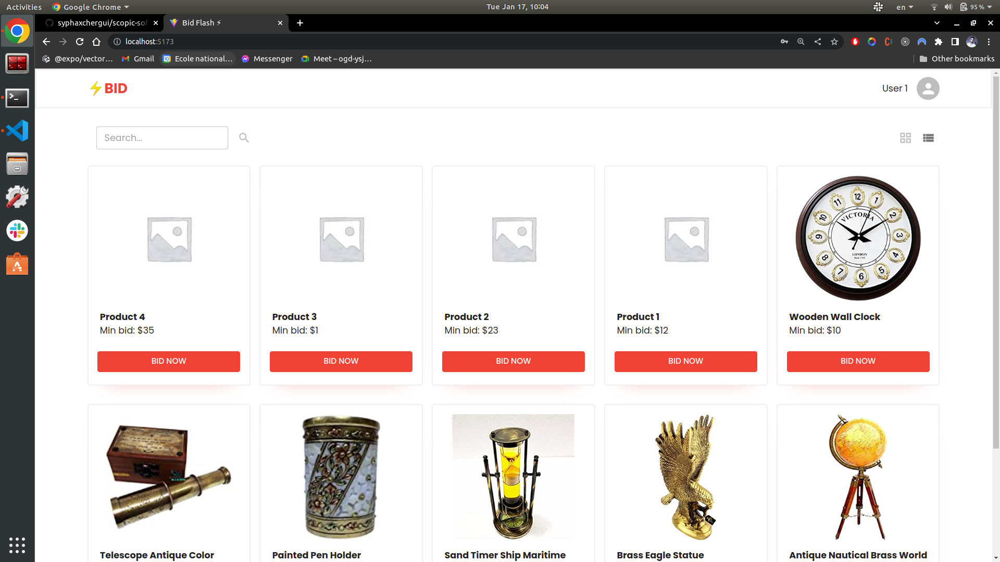
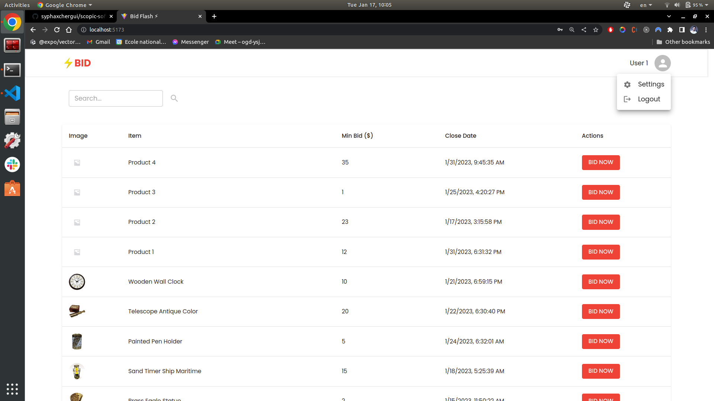
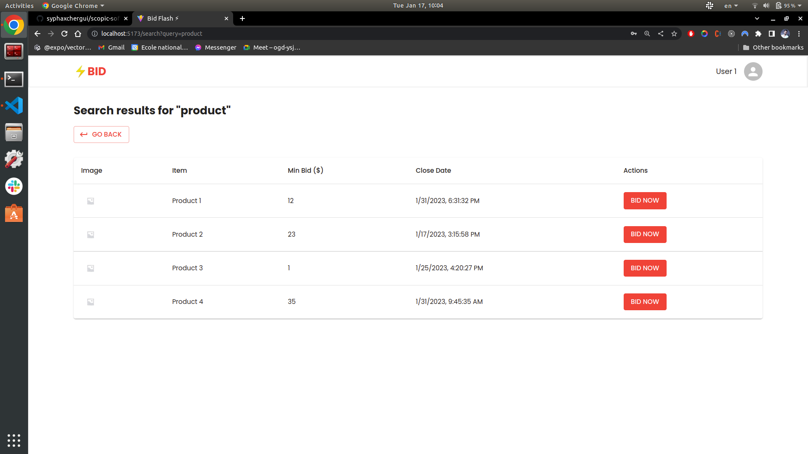
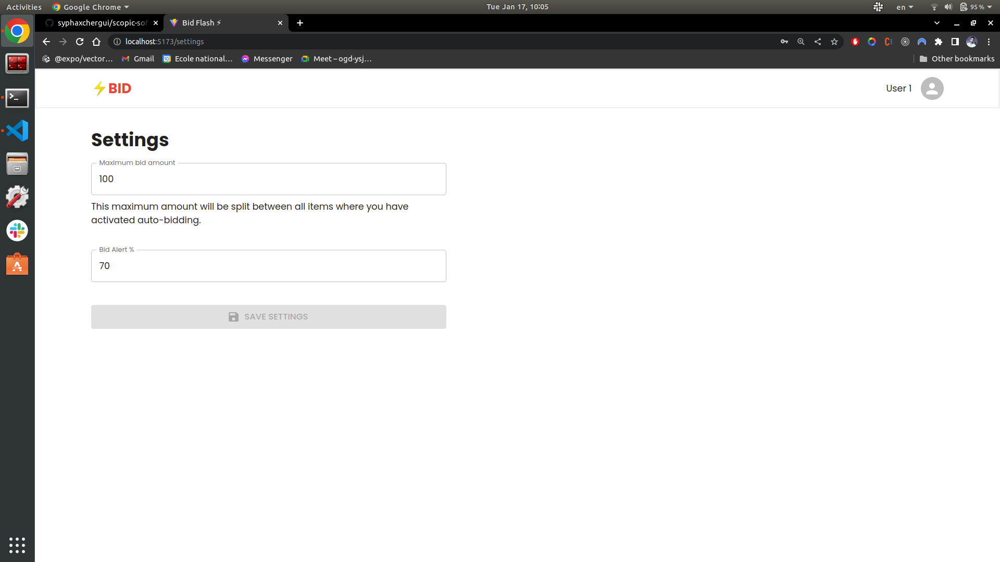
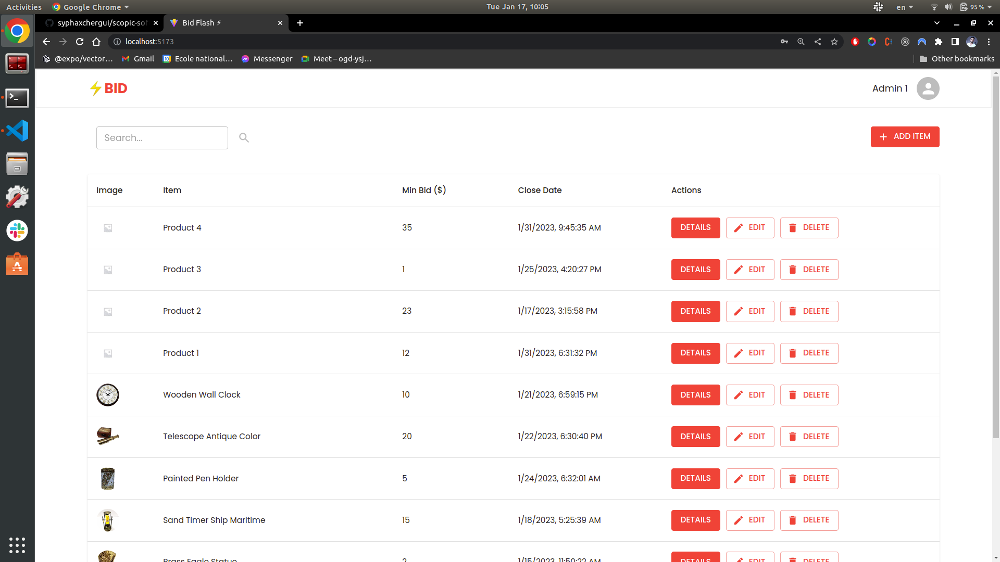
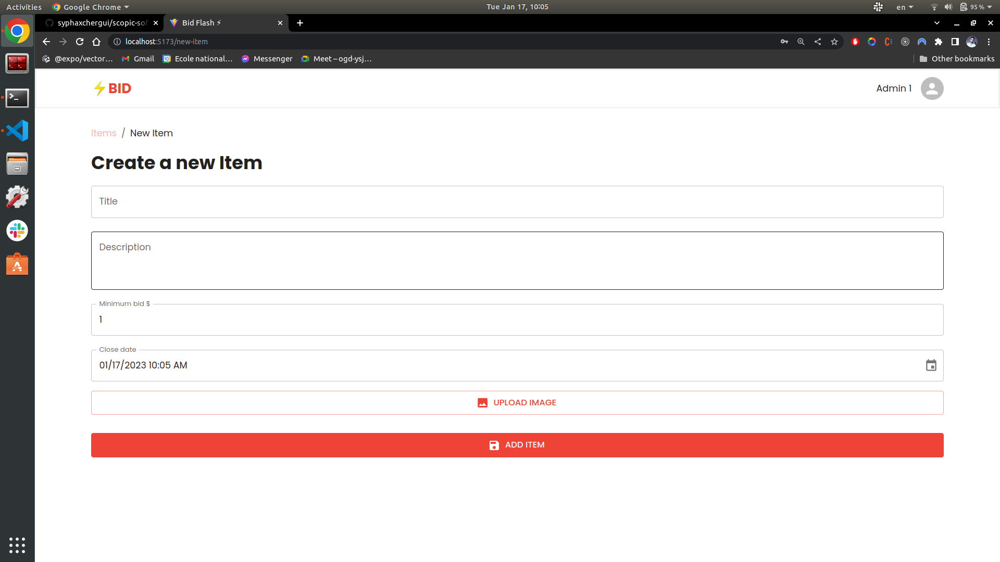
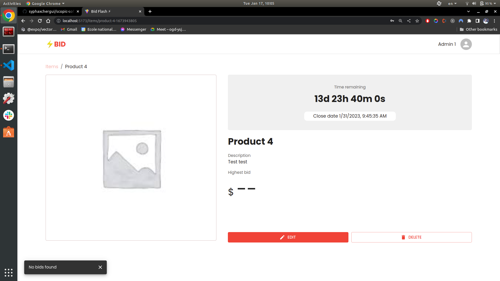

# Auction App | Scopic Software Test Task

A web auction application for an antique items seller. The application will allow users to bid on antique items displayed in the site and admin users to set up items for auction.

# Getting Started

## Tools Used

- Frontend **`ReactJs`** ;
- Backend **`NodeJs`** and **`ExpressJs`** ;
- Database **`MongoDB`** ;
- Image are uploaded using **`Cloudinary`**.

## Backend

The Backend app uses a MongoDB Atlas Cluster as a database

### Install Backend Dependencies

In order to install the backend project dependencies run inside the backend folder:

> **npm** install

### Running Backend Application

The following command inside the backend folder will run the backend server:

> **npm** start

After this you would be able to access backend at http://localhost:5000.

## Frontend

### Install Frontend Dependencies

In order to install the frontend project dependencies run inside the frontend folder:

> **npm** install

### Running Frontend Application

The following command will run the SPA in local dev server:

> **npm** run dev

The application will be available at http://localhost:5173/ and by default you should see the login screen.

## Production Build

In order to prepare production build you need to run in the frontend and in the backend folder the following command:

> **npm** run build

It is important to make sure that code can be built for production succesfully before submitting the solution.

## Default User Setup

The app uses dummy user authentication implemented into the system with hardcoded user credentials in the code. You can access it with the following users:

### Admin users (Role: ADMIN)

- **username:** admin2@gmail.com
- **password:** password

---

- **username:** admin2@gmail.com
- **password:** password

---

### Regular users (Role: USER)

- **username:** user1@gmail.com
- **password:** password

---

- **username:** user2@gmail.com
- **password:** password

---

- **username:** user3@gmail.com
- **password:** password

---

# Screenshots

## Login Screen

## User Screens

## Admin Screens

