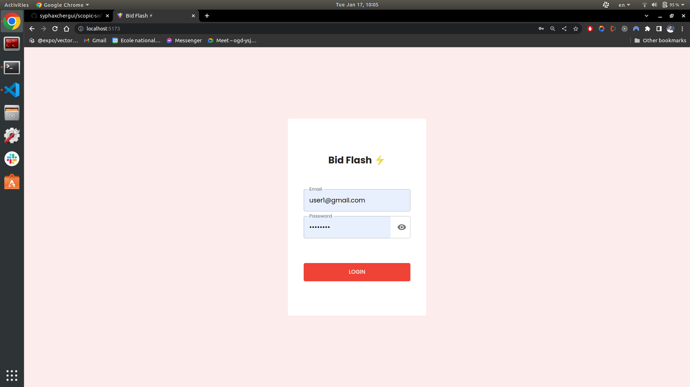

# Auction App

A web auction application for an antique items seller. The application will allow users to bid on antique items displayed in the site and admin users to set up items for auction.

# New Features 

## Tools Used

- Real time updates **`socket.io`** ;
- Sending email **`nodemailer`** ;
- Scheduling emails ...etc (cron jobs) **`node-schedule`**.

## Nodemailer setup

Go to `.env` file and change the `EMAIL_USERNAME` and the `EMAIL_PASSWORD` to the email address from where email would be sending

Some email screenshots are available inside ./screenshots/email_exemples

For Gmail integration: https://community.nodemailer.com/using-gmail/

## Overview of few new features

- Real-time updates of the latest bid in the Item details + Item award upon action finish :
  Login as an admin and update the close date of an item to 2 or 3 min from now, Open two tabs with two different users, bid from the two users, the highest bid and the last bidder updates in real-time. Once the biding is closed, the winner gets redirected to the bill page (+Email), and the other gets a message(+Email)

- Profile page : In this page the user can see the items he bid on, there status, details and if he won that bid he can generate a bill.

- Email notifications: email are sent when the bidding is closed, when the max bid is reached, bid is made from another user...

## Docker deployment

### Backend

The backend is deployed using docker. An image is available here: https://hub.docker.com/r/syphax0808/auction-app-backend

`docker run -p 49160:5000 -d syphax0808/auction-app-backend`

### Frontend

The Frontend is deployed using docker. An image is available here: https://hub.docker.com/r/syphax0808/auction-app-frontend

`docker run -p 5173:5173 -d syphax0808/auction-app-frontend`

The app will be available at http://0.0.0.0:5173

## Postman documentation

This is the link to the postman documentation for the API https://documenter.getpostman.com/view/15078593/2s8ZDeSJaU

## New Pages screenshots

# PART 1 Test Task

## Tools Used

- Frontend **`ReactJs`** ;
- Backend **`NodeJs`** and **`ExpressJs`** ;
- Database **`MongoDB`** ;
- Image are uploaded using **`Cloudinary`**.

## Backend

The Backend app uses a MongoDB Atlas Cluster as a database

### Install Backend Dependencies

In order to install the backend project dependencies run inside the backend folder:

> **npm** install

### Running Backend Application

The following command inside the backend folder will run the backend server:

> **npm** start

After this you would be able to access backend at http://localhost:5000.

## Frontend

### Install Frontend Dependencies

In order to install the frontend project dependencies run inside the frontend folder:

> **npm** install

### Running Frontend Application

The following command will run the SPA in local dev server:

> **npm** run dev

The application will be available at http://localhost:5173/ and by default you should see the login screen.

## Production Build

In order to prepare production build you need to run in the frontend and in the backend folder the following command:

> **npm** run build

It is important to make sure that code can be built for production succesfully before submitting the solution.

## Default User Setup

The app uses dummy user authentication implemented into the system with hardcoded user credentials in the code. You can access it with the following users:

### Admin users (Role: ADMIN)

- **username:** admin2@gmail.com
- **password:** password

---

- **username:** admin2@gmail.com
- **password:** password

---

### Regular users (Role: USER)

- **username:** user1@gmail.com
- **password:** password

---

- **username:** user2@gmail.com
- **password:** password

---

- **username:** user3@gmail.com
- **password:** password

---

# Screenshots

## Login Screen

## User Screens

## Admin Screens

